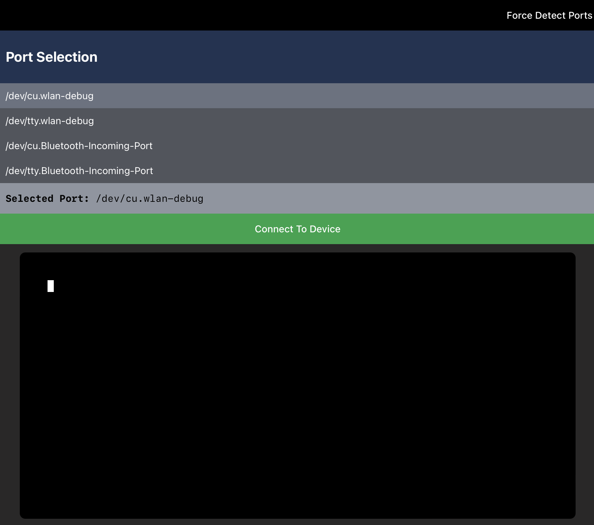
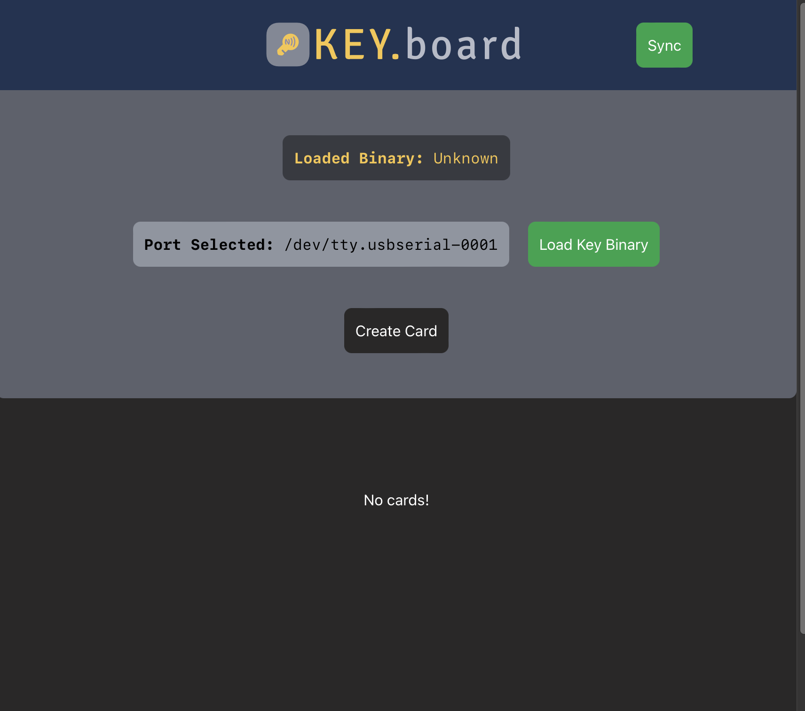
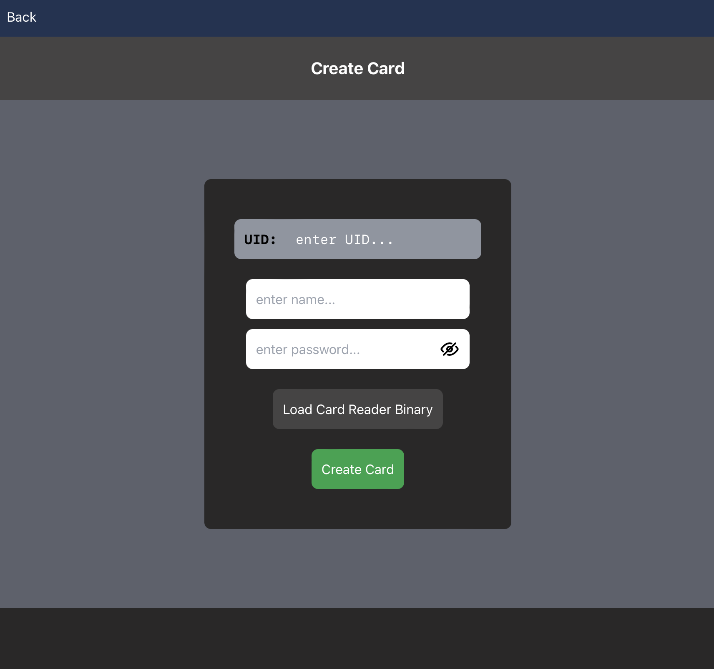
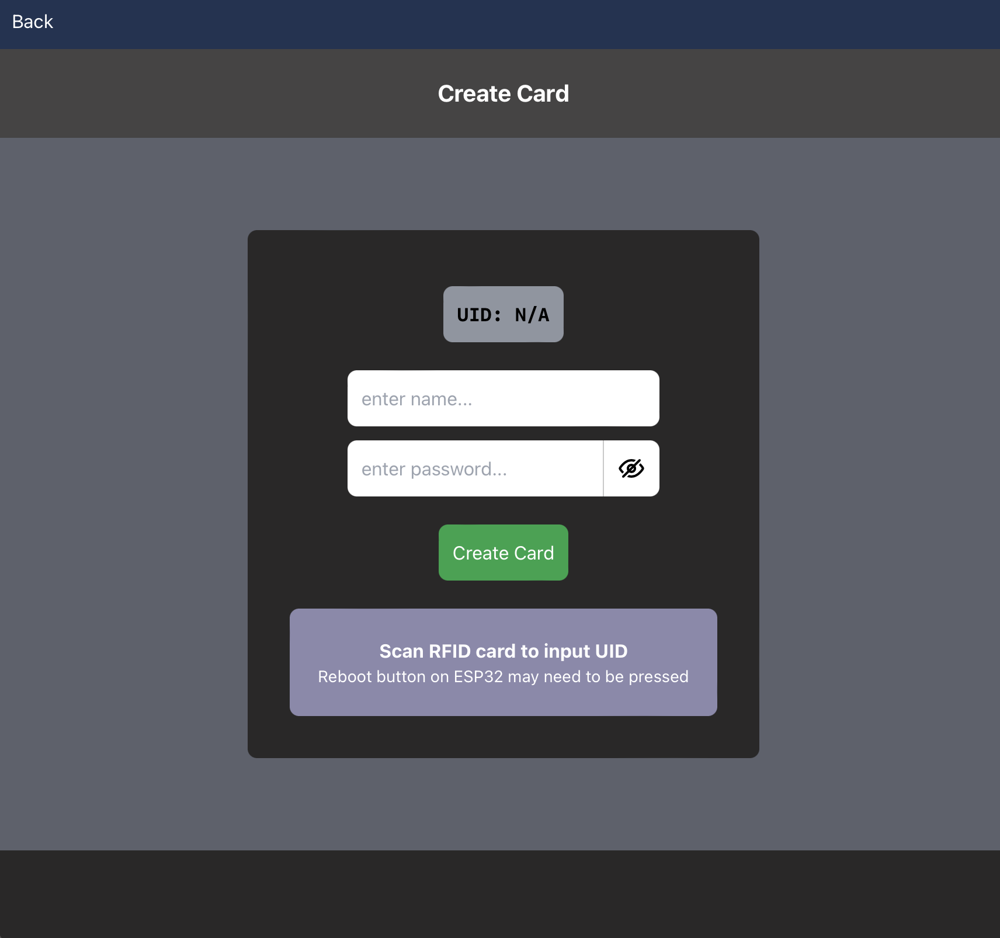
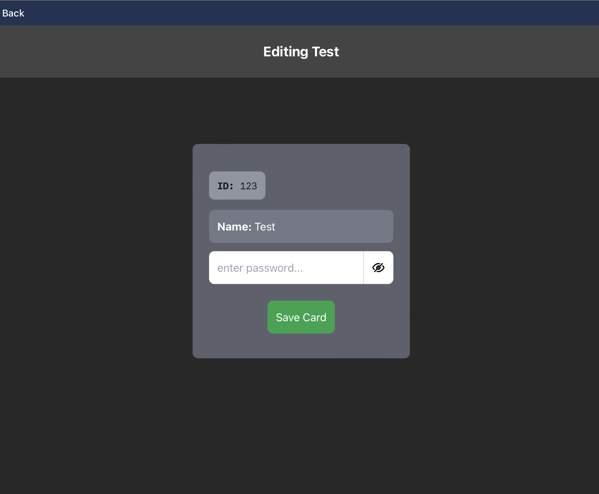
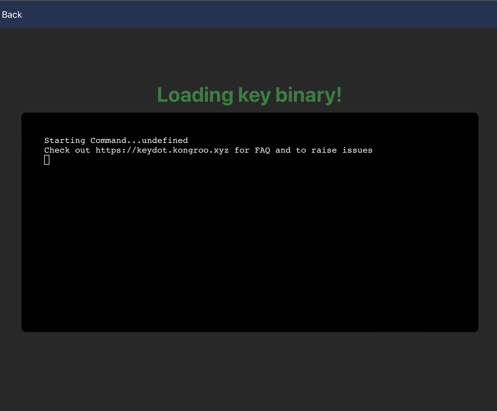
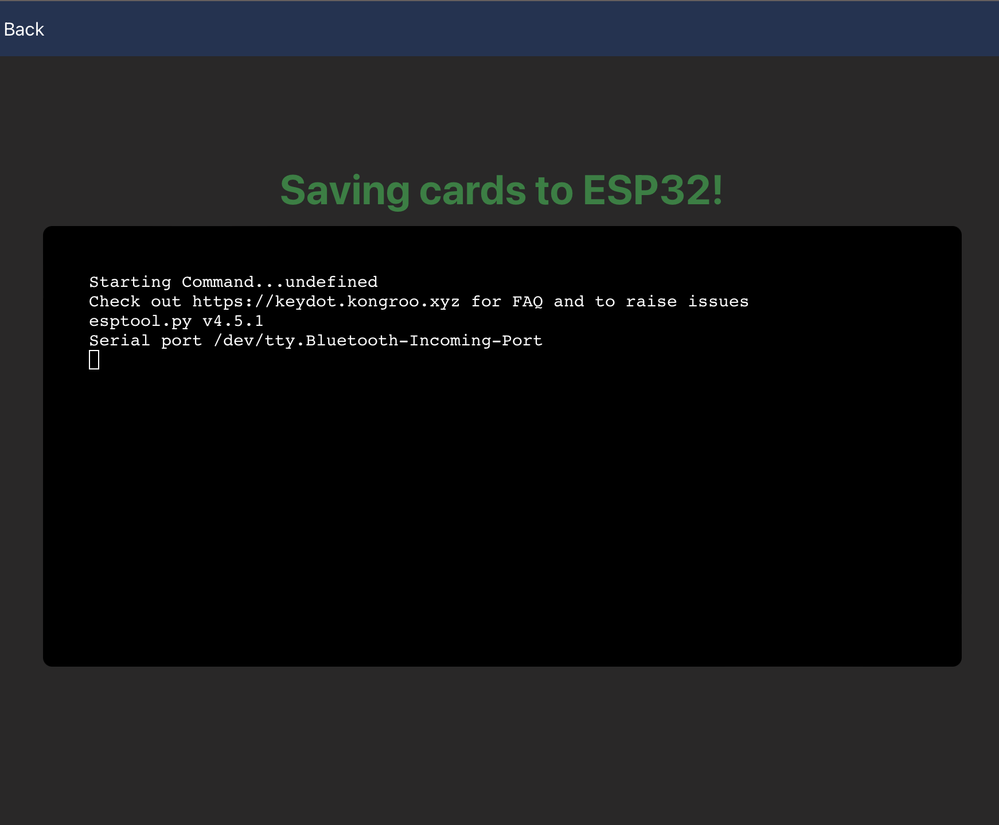

## User Guide
### General Workflow
This will summarise the intended usage of the application 
1. Install and run the keyDOTboard application
2. Select the port that the ESP32 is connected to
3. Go to the create cards screen where you have two options to input the RFID ID of the card that you're using
	1. Input the RFID ID manually
	2. Press the **Load Card Reader Binary** button which will allow you to use the RFID card reader to input the RFID ID into the create card form
4. The password of a created card can be edited afterwards, if you would like to change the ID or name, you will need to delete the card and create it again. 
5. Press the **Sync** button on the home screen
6. Finally, press the **Load Key Binary** button on the home screen to load up the primary binary that will input your chosen password whenever you scan the corresponding RFID card.

Errors will be produced by the program itself whenever relevant with any additional context provided with included terminals on the screens that require them. 

### Ports Screen
1. Choose the port from the list of detected ports that corresponds with the port that the ESP32 is connected to and press **Connect to Device**

	- If you plug in the device after you loaded this screen, you can press **Force Detect Ports** to re-load the list of your computer's ports
2. The terminal will take some time loading up the selected port and detect if there are any pre-existing cards on the ESP32's partition and load them into the program accordingly. 
	- If there are no pre-existing cards, the program will be loaded with an empty cards DB. 

### Home Screen

- **Loaded Binary -** will display the name of the currently loaded binary that is on the ESP32. 
- **Create Card -** will navigate you to the **Create Card** screen
- **Sync -** will bounce whenever the program detects that there have been changes to the card data and require you to push said data to the ESP32's partition
- **Load Key Binary -** will load the primary binary of the program that will allow the ESP32 to sent keyboard input
- **Port Selected -** this can be clicked on to navigate back to the **Ports Screen** if you need to change the port again. 
- **Cards -** all cards will be displayed in the bottom half of the screen, showing ID and name information, which you can individually **Edit** and **Delete**

### Create Cards Screen
After creating a card it will automatically navigate you back to the home screen and save the card that you made to the card list.

#### Manual RFID Input

1. Fill out the UID of the RFID card
2. Fill out the name of the card
3. Fill out the password that you want to be using to login
4. Press **Create Card**

#### Scanned RFID Input

1. Press **Load Card Reader Binary** and wait for the terminal to execute the commands that it needs to
2. Scan your RFID card on the card reader and the UID will be populated automatically (you may need to reboot the ESP32)
3. Press **Create Card**

### Edit Cards Screen
After pressing the **Edit** button on a card you will be taken to this screen where you can change the password of the card that you selected. 

Press **Save Card** after your changes have been made. 

### Terminal Screens

The following screens will appear on the **Sync** and **Load Key Binary** screens, with the terminals providing additional context to how the program is interacting with the ESP32.

**Load Key Binary**

**Sync**
